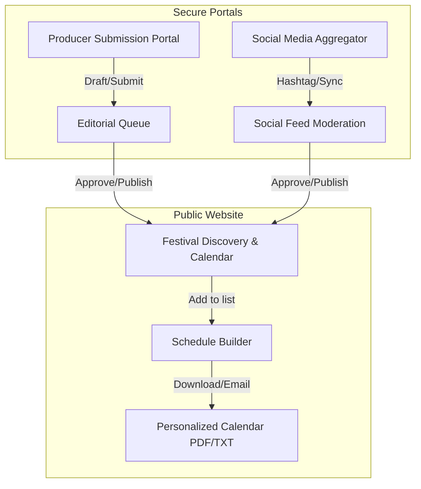

# Save Philly Festivals: Core Features Client Demo & Walkthrough Guide

This guide highlights the key functional areas of the modernized **Save Philly Festivals** application. It serves as a walkthrough script for demonstrating the system to clients, stakeholders, and operators.

---

## 🌟 Modernized Architecture & Design System

The application has been overhauled to follow a high-fidelity **glassmorphic design system** (inspired by Antigravity aesthetics). Key visual upgrades include:
*   **Harmonious Color Palettes:** Sophisticated slate, amber, blue, and green HSL-based palettes replace raw defaults.
*   **Accessible Visual Hierarchy:** Cards and layouts utilize smooth shadow systems, elevated borders, and clear semantic landmarks.
*   **Next.js 13+ Compliance:** Eliminates all deprecated Next.js Link behaviors, resolving hydration warnings and guaranteeing optimal SEO routing.

---

## 🚀 Core Features Walkthrough

### 1. Public Festival Discovery & Interactive Calendar
Allows public visitors to search, filter, and explore all current and upcoming Philadelphia festivals.

*   **Key Highlights:**
    *   **Universal Search:** Real-time query submission reflecting URL query states for instant back/forward navigation.
    *   **Accessible Calendar Grid:** Grid system exposing selected-day and month-control semantics for keyboard navigability.
    *   **Intentional No-Results Fallbacks:** Clean empty states offering alternatives instead of dead ends.
*   **Demo Scenario:**
    1.  Navigate to the homepage `/`.
    2.  Use the search input to filter for a keyword (e.g., "Beer").
    3.  Toggle filters and navigate months on the `/calendar` tab. Note how the URL updates dynamically, preserving state.

---

### 2. Personalized Schedule Builder
Enables visitors to construct a custom itinerary of festivals and events without needing to register for an account.

*   **Key Highlights:**
    *   **Accountless Persistence:** Uses local storage to retain checked events across page refreshes.
    *   **Schedule Export & Sharing:** Download selected itineraries as a clean `.txt` or `.ics` document, or email them directly.
    *   **Granular Marketing Consent:** Separate, transparent checkmarks for organizer consent and general marketing emails.
*   **Demo Scenario:**
    1.  On the homepage, select **Add to Schedule** on multiple festival cards.
    2.  Click the floating schedule summary to view the **Schedule Builder**.
    3.  Enter an email address, configure marketing preferences, and trigger a test export.

---

### 3. Producer Submission Portal
A self-service workspace where festival coordinators submit their events for editorial review.

*   **Key Highlights:**
    *   **Save Draft Progression:** Save incomplete forms and resume editing later without risking data loss.
    *   **Secure Private Asset Uploads:** Direct-to-storage upload of festival flyers, logos, and graphic assets.
    *   **Live Status Badges:** Clearly labels state changes (e.g., `Draft`, `Pending review`, `Approved`, `Changes Requested`) on a timeline card.
*   **Demo Scenario:**
    1.  Log in as a verified producer at `/login`.
    2.  Fill in the festival details (Name, Location, dates, and Description).
    3.  Upload an image file under **Promotional Asset**.
    4.  Click **Review submission** to see a read-only preview, then submit. The status transitions to **Pending review** and locks the input fields to prevent modification during review.

---

### 4. Admin Editorial Workflow
The command center for administrators to moderate submissions, enforce guidelines, and publish listings.

| Queue State | Operator Action | System Consequence |
| :--- | :--- | :--- |
| **Pending Review** | Click *Approve* or *Publish* | Promotes to live calendar; sends email notice to Producer. |
| **Pending Review** | Click *Request Changes* | Sends draft back to Producer with feedback log; unlocks editing. |
| **Approved** | Click *Cancel Festival* | Generates a public **Cancellation Tombstone** on the discovery page. |

*   **Key Highlights:**
    *   **Structured Feedback Loop:** Mandatory feedback messages when rejecting or requesting changes.
    *   **Private Approvals:** Approve a festival to preview it securely before publishing it live.
*   **Demo Scenario:**
    1.  Navigate to `/admin/festivals`.
    2.  Select the producer's submission from the **Pending review** tab.
    3.  Reject the submission, prompting a modal. Enter a moderation reason and log it.
    4.  Notice the state change timeline reflects the decision.

---

### 5. Moderated Social Feed Aggregator
Aggregates live social media posts (via hashtags) to display a community gallery on the festival details page.

*   **Key Highlights:**
    *   **Aggregation Providers:** Standard integrations for Flockler and Curator.io.
    *   **Granular Post Moderation:** Review posts by marking them *Approved*, *Hidden*, or *Rejected*.
    *   **Audit-Safe Moderation Reasons:** Enforces internal reason logs for hiding or rejecting social items to maintain operation logs.
*   **Demo Scenario:**
    1.  Go to the admin dashboard and select **Social Feed Manager**.
    2.  Update the feed settings (e.g., Hashtag: `#PhillyBeerFest`).
    3.  Click **Save social feed**. A confirmation toast will report the successful save.
    4.  Under the feed list, click **Hide** on a post. Type "Spam post containing off-topic advertisement" as the moderation reason to finalize the action.

---

> [!NOTE]
> All core workflows described in this guide are backed by E2E verification tests to prevent regressions in production.
